# Network Devices Overview

## Hub
A hub is a network device that broadcasts information to every device on the network.

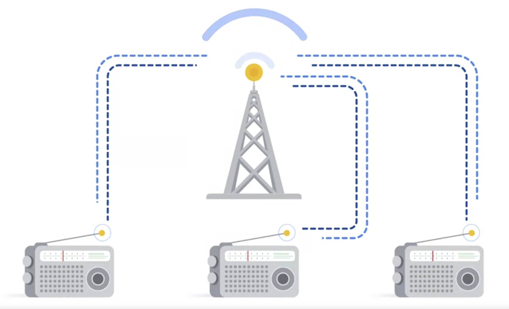

### When to Use:
- **MAC Address:** Hubs operate at the data link layer (Layer 2) and use MAC addresses to identify devices on the network.

## Switch
A switch is a network device that makes connections between specific devices on a network by sending and receiving data between them. Switches are more intelligent than hubs since they only pass data to the intended destination. This makes them more secure than hubs.

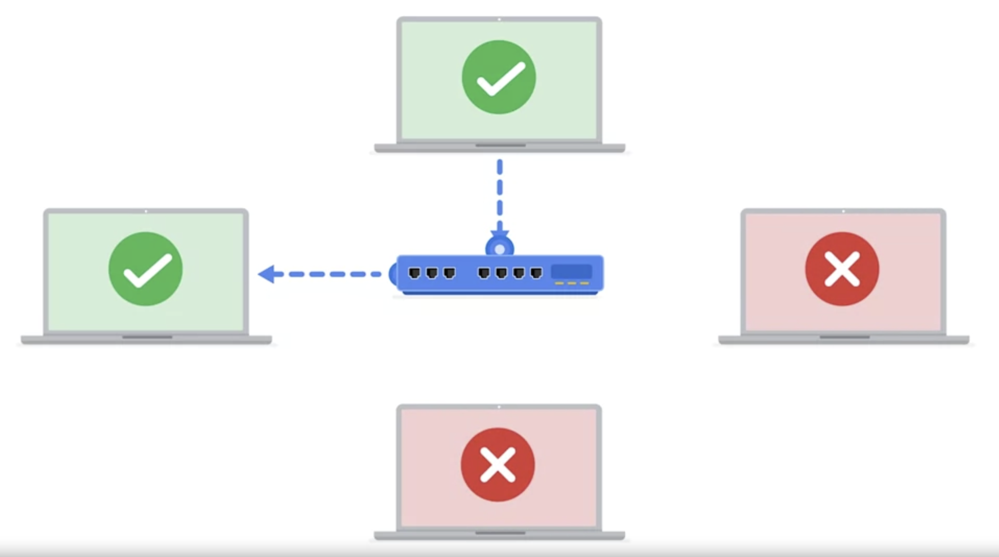

### When to Use:
- **MAC Address:** Switches also operate at the data link layer (Layer 2) and use MAC addresses to direct data to the correct device on the local network.

## Router
A router is a network device that connects multiple networks together. If a computer wants to send information to a computer on another network, then:
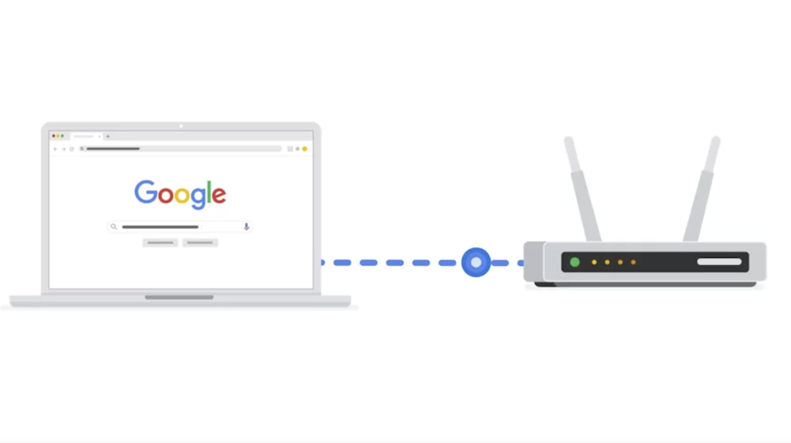
1. The information travels from the computer to the router.
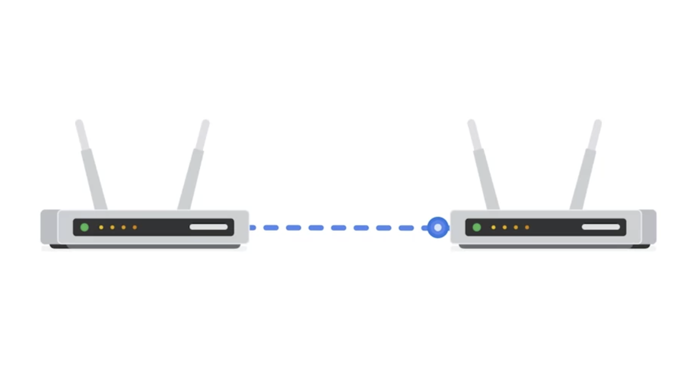
2. The router reads the destination address and forwards the data to the intended network router.
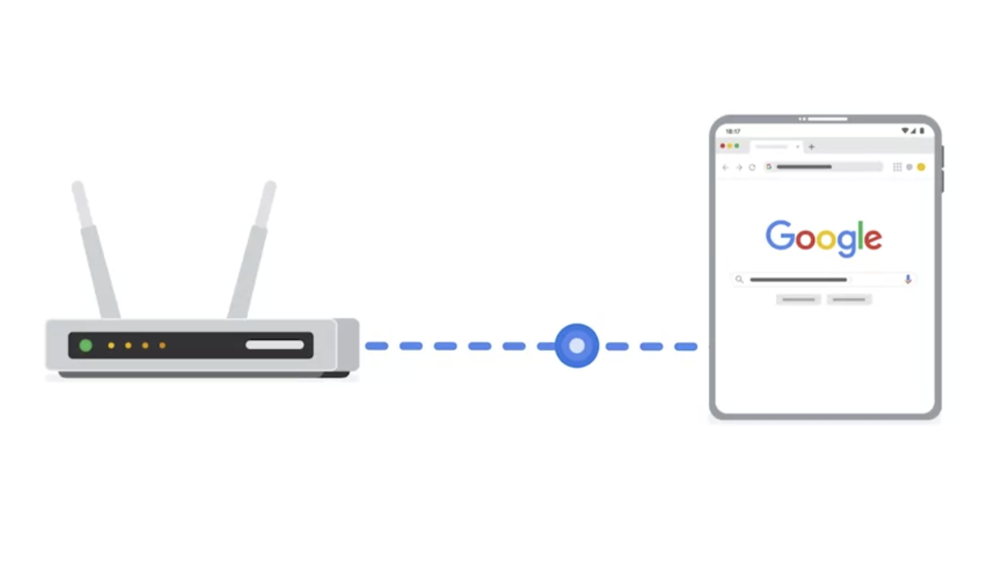
3. Finally, the receiving router directs that information to the destination PC.

### When to Use:
- **IP Address:** Routers operate at the network layer (Layer 3) and use IP addresses to route data between different networks. When accessing a website or sending data over the internet, IP addresses are used to determine the data's path.

## Modem
A modem is a device that connects your router to the internet and brings internet access to the LAN. The process is as follows:
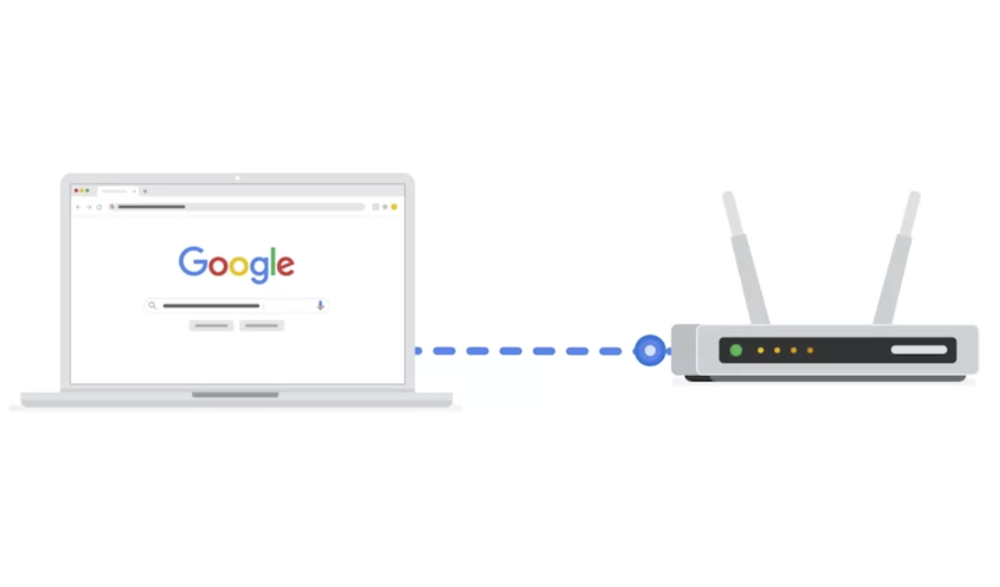
1. The computer sends information to the router.
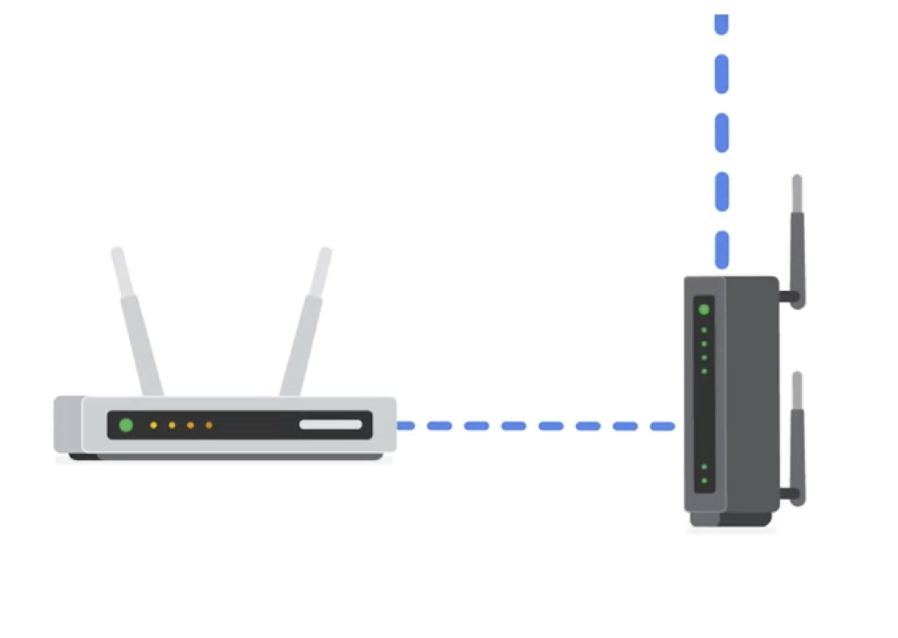
2. The router transports the information through the modem
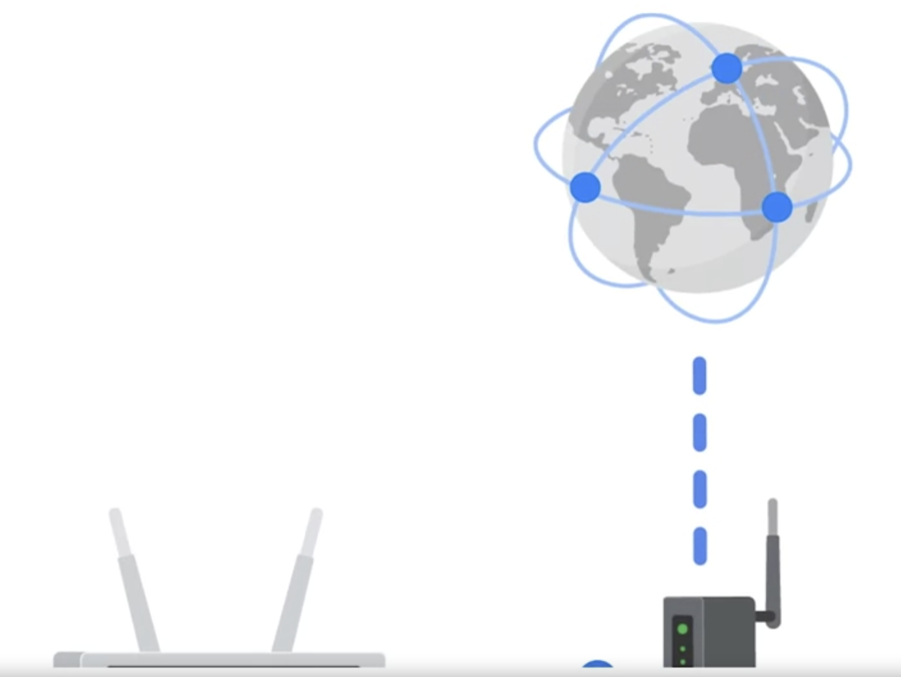
3. to the internet.
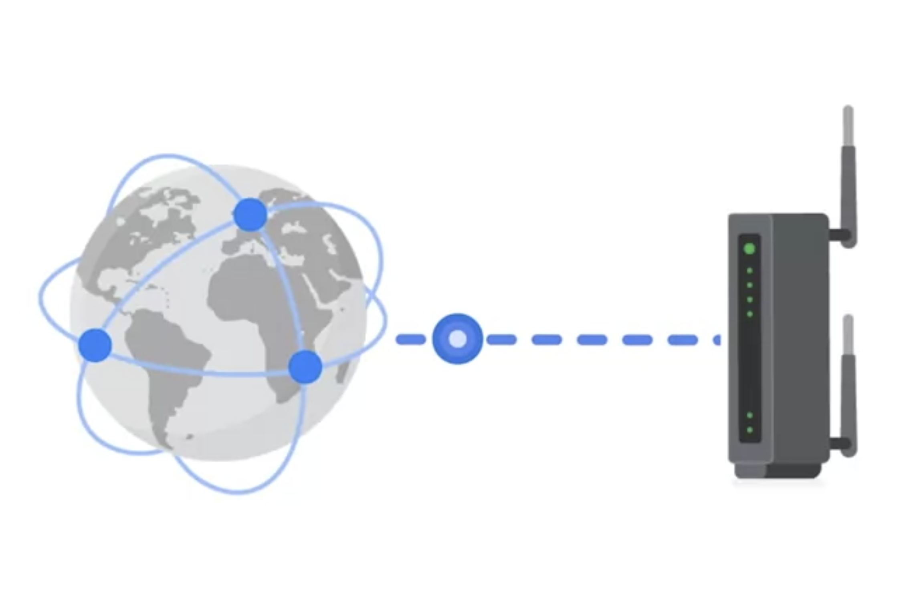
4. The intended recipient modem receives the information
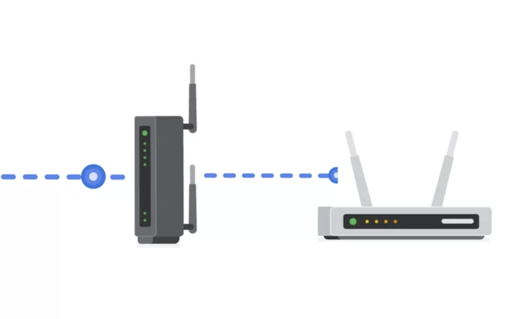
5. and transports it to the intended router.
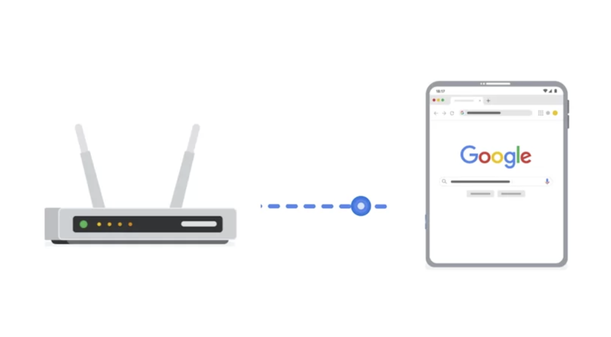
6. Finally, the receiving router directs that information to the destination PC.

### When to Use:
- **IP Address:** Modems work with routers to provide internet access, using IP addresses to communicate with other devices on the internet.

## Virtualization Tools
Virtualization tools are software that perform network operations.

- Virtualization tools carry out functions that would normally be completed by a hub, switch, router, or modem.
- They are often provided by cloud providers.
- These tools provide opportunities for cost savings and scalability.

### When to Use:
- **IP Address & MAC Address:** Virtualization tools often simulate the functions of physical network devices, using both IP and MAC addresses to manage and route data in virtual environments.
